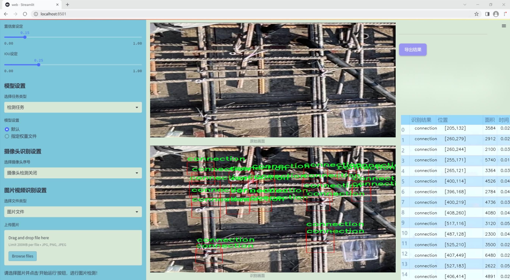
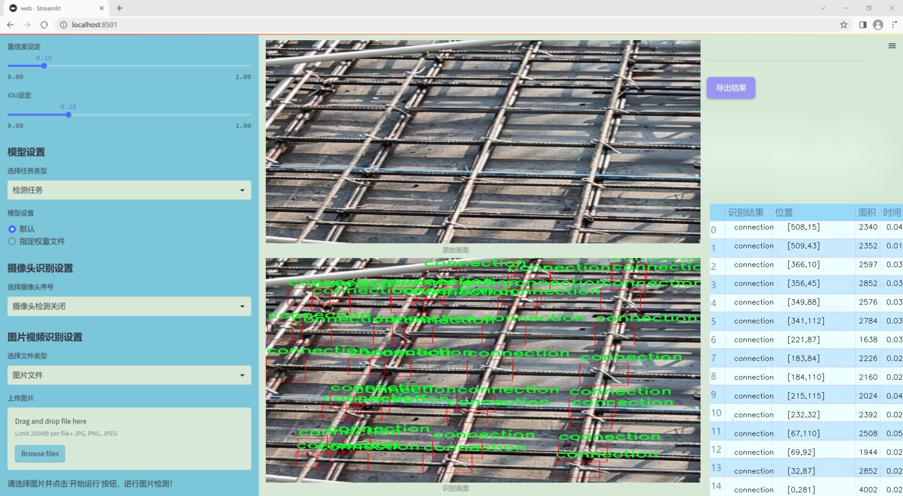
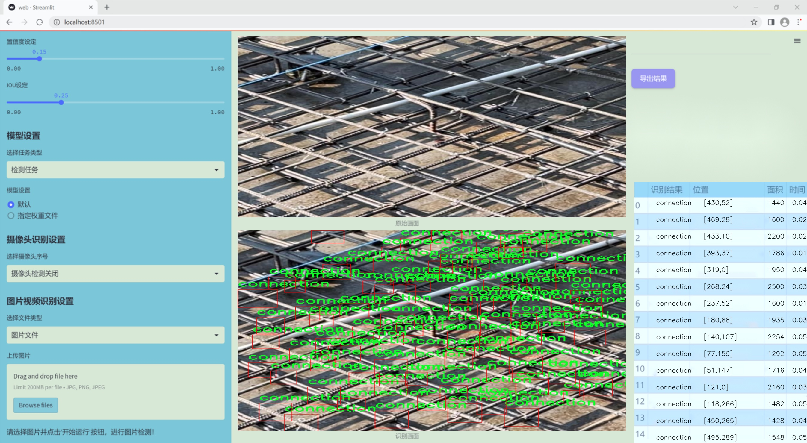
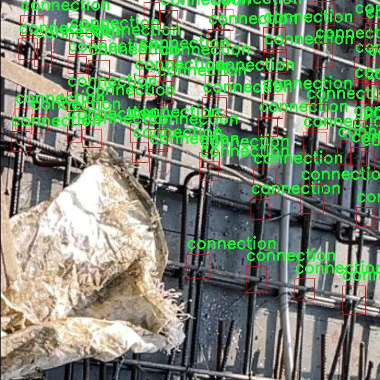
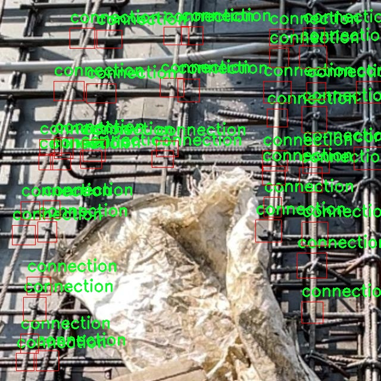
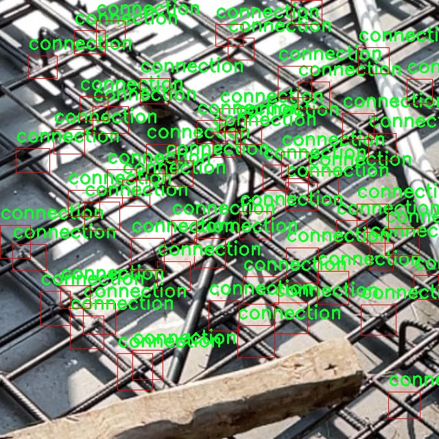
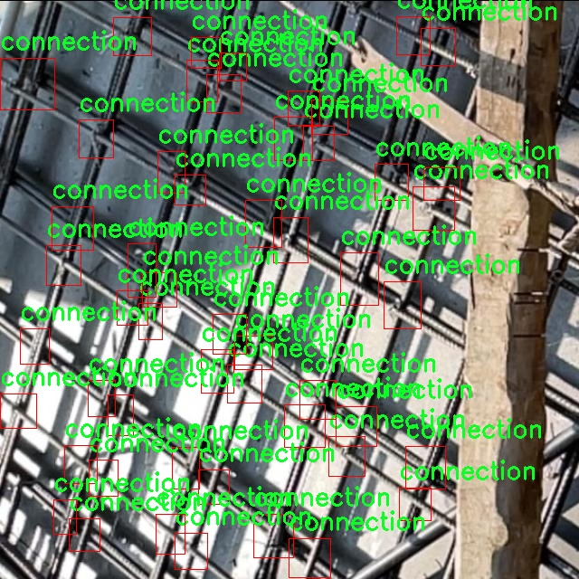

### 1.背景意义

研究背景与意义

随着建筑行业的快速发展，钢筋混凝土结构在现代建筑中扮演着至关重要的角色。钢筋的连接点是结构安全性和稳定性的关键因素之一，准确识别和检测这些连接点对于确保建筑物的整体强度和耐久性至关重要。然而，传统的人工检测方法不仅耗时耗力，而且容易受到人为因素的影响，导致检测结果的不准确。因此，开发一种高效、准确的钢筋交点识别检测系统显得尤为重要。

近年来，深度学习技术在计算机视觉领域取得了显著进展，尤其是目标检测算法的快速发展为钢筋交点的自动识别提供了新的解决方案。YOLO（You Only Look Once）系列算法因其高效性和实时性，已成为目标检测领域的热门选择。特别是YOLOv11的改进版本，凭借其更强的特征提取能力和更快的推理速度，能够在复杂的建筑环境中实现对钢筋连接点的精准检测。

本研究旨在基于改进的YOLOv11算法，构建一个钢筋交点识别检测系统。通过利用包含74张图像的数据集，该系统将专注于识别“连接”这一类别。数据集经过精心标注，并应用了一系列预处理和数据增强技术，以提高模型的鲁棒性和准确性。通过引入多种图像变换方法，如水平翻转和旋转，模型将能够更好地适应不同的拍摄角度和环境变化，从而提升识别的准确性。

本项目的实施不仅能够提高钢筋交点的检测效率，还将为建筑行业的智能化发展提供重要的技术支持。通过实现自动化检测，能够有效降低人工成本，减少人为错误，提高建筑安全性，为未来的建筑设计和施工提供更为可靠的保障。

### 2.视频效果

[2.1 视频效果](https://www.bilibili.com/video/BV1WTmbYmEpK/)

### 3.图片效果







##### [项目涉及的源码数据来源链接](https://kdocs.cn/l/cszuIiCKVNis)**

注意：本项目提供训练的数据集和训练教程,由于版本持续更新,暂不提供权重文件（best.pt）,请按照6.训练教程进行训练后实现上图演示的效果。

### 4.数据集信息

##### 4.1 本项目数据集类别数＆类别名

nc: 1
names: ['connection']


该项目为【目标检测】数据集，请在【训练教程和Web端加载模型教程（第三步）】这一步的时候按照【目标检测】部分的教程来训练

##### 4.2 本项目数据集信息介绍

本项目数据集信息介绍

本项目旨在改进YOLOv11模型，以实现对钢筋交点的高效识别与检测。为此，我们构建了一个专门针对“connection-detection”主题的数据集，该数据集专注于钢筋交点的识别，旨在为深度学习模型提供高质量的训练样本。数据集中包含的类别数量为1，具体类别为“connection”，这意味着所有的标注和数据均围绕着钢筋交点的特征进行构建。

在数据集的构建过程中，我们收集了大量的钢筋交点图像，涵盖了不同的环境、角度和光照条件，以确保模型在多样化场景下的鲁棒性。每张图像都经过精细的标注，确保钢筋交点的准确定位。标注过程不仅考虑了交点的几何形状，还考虑了其在不同构造中的相对位置和特征。这种精确的标注方式为YOLOv11模型的训练提供了坚实的基础，使其能够在实际应用中有效识别和检测钢筋交点。

此外，数据集的多样性和丰富性使得模型能够学习到不同情况下的特征表现，从而提高其泛化能力。我们还进行了数据增强处理，通过旋转、缩放、裁剪等手段，进一步扩展了数据集的规模和多样性。这一系列的准备工作确保了模型在面对真实世界的复杂情况时，能够保持高效的识别能力。

总之，本项目的数据集不仅为YOLOv11模型的训练提供了必要的支持，还为钢筋交点的自动识别与检测奠定了坚实的基础，期待通过本项目的实施，能够在建筑工程领域实现更高效的钢筋施工质量监控。










### 5.全套项目环境部署视频教程（零基础手把手教学）

[5.1 所需软件PyCharm和Anaconda安装教程（第一步）](https://www.bilibili.com/video/BV1BoC1YCEKi/?spm_id_from=333.999.0.0&vd_source=bc9aec86d164b67a7004b996143742dc)


[5.2 安装Python虚拟环境创建和依赖库安装视频教程（第二步）](https://www.bilibili.com/video/BV1ZoC1YCEBw?spm_id_from=333.788.videopod.sections&vd_source=bc9aec86d164b67a7004b996143742dc)

### 6.改进YOLOv11训练教程和Web_UI前端加载模型教程（零基础手把手教学）

[6.1 改进YOLOv11训练教程和Web_UI前端加载模型教程（第三步）](https://www.bilibili.com/video/BV1BoC1YCEhR?spm_id_from=333.788.videopod.sections&vd_source=bc9aec86d164b67a7004b996143742dc)


按照上面的训练视频教程链接加载项目提供的数据集，运行train.py即可开始训练



     Epoch   gpu_mem       box       obj       cls    labels  img_size
     1/200     20.8G   0.01576   0.01955  0.007536        22      1280: 100%|██████████| 849/849 [14:42<00:00,  1.04s/it]
               Class     Images     Labels          P          R     mAP@.5 mAP@.5:.95: 100%|██████████| 213/213 [01:14<00:00,  2.87it/s]
                 all       3395      17314      0.994      0.957      0.0957      0.0843

     Epoch   gpu_mem       box       obj       cls    labels  img_size
     2/200     20.8G   0.01578   0.01923  0.007006        22      1280: 100%|██████████| 849/849 [14:44<00:00,  1.04s/it]
               Class     Images     Labels          P          R     mAP@.5 mAP@.5:.95: 100%|██████████| 213/213 [01:12<00:00,  2.95it/s]
                 all       3395      17314      0.996      0.956      0.0957      0.0845

     Epoch   gpu_mem       box       obj       cls    labels  img_size
     3/200     20.8G   0.01561    0.0191  0.006895        27      1280: 100%|██████████| 849/849 [10:56<00:00,  1.29it/s]
               Class     Images     Labels          P          R     mAP@.5 mAP@.5:.95: 100%|███████   | 187/213 [00:52<00:00,  4.04it/s]
                 all       3395      17314      0.996      0.957      0.0957      0.0845


###### [项目数据集下载链接](https://kdocs.cn/l/cszuIiCKVNis)

### 7.原始YOLOv11算法讲解


###### YOLOv11改进方向

与YOLOv 10相比，YOLOv 11有了巨大的改进，包括但不限于：

  * 增强的模型结构：模型具有改进的模型结构，以获取图像处理并形成预测
  * GPU优化：这是现代ML模型的反映，GPU训练ML模型在速度和准确性上都更好。
  * 速度：YOLOv 11模型现在经过增强和GPU优化以用于训练。通过优化，这些模型比它们的前版本快得多。在速度上达到了25%的延迟减少！
  * 更少的参数：更少的参数允许更快的模型，但v11的准确性不受影响
  * 更具适应性：更多支持的任务YOLOv 11支持多种类型的任务、多种类型的对象和多种类型的图像。

###### YOLOv11功能介绍

Glenn Jocher和他的团队制作了一个令人敬畏的YOLOv 11迭代，并且在图像人工智能的各个方面都提供了YOLO。YOLOv 11有多种型号，包括：

  * 对象检测-在训练时检测图像中的对象
  * 图像分割-超越对象检测，分割出图像中的对象
  * 姿态检测-当用点和线训练时绘制一个人的姿势
  * 定向检测（OBB）：类似于对象检测，但包围盒可以旋转
  * 图像分类-在训练时对图像进行分类

使用Ultralytics Library，这些模型还可以进行优化，以：

  * 跟踪-可以跟踪对象的路径
  * 易于导出-库可以以不同的格式和目的导出
  * 多场景-您可以针对不同的对象和图像训练模型

此外，Ultralytics还推出了YOLOv 11的企业模型，该模型将于10月31日发布。这将与开源的YOLOv
11模型并行，但将拥有更大的专有Ultralytics数据集。YOLOv 11是“建立在过去的成功”的其他版本的之上。

###### YOLOv11模型介绍

YOLOv 11附带了边界框模型（无后缀），实例分割（-seg），姿态估计（-pose），定向边界框（-obb）和分类（-cls）。

这些也有不同的尺寸：纳米（n），小（s），中（m），大（l），超大（x）。


YOLOv11模型

###### YOLOv11与前版本对比

与YOLOv10和YOLOv8相比，YOLOv11在Ultralytics的任何帖子中都没有直接提到。所以我会收集所有的数据来比较它们。感谢Ultralytics：

**检测：**


YOLOv11检测统计


YOLOv10检测统计

其中，Nano的mAPval在v11上为39.5，v10上为38.5；Small为47.0 vs 46.3，Medium为51.5 vs
51.1，Large为53.4 vs 53.2，Extra Large为54.7vs
54.4。现在，这可能看起来像是一种增量增加，但小小数的增加可能会对ML模型产生很大影响。总体而言，YOLOv11以0.3
mAPval的优势追平或击败YOLOv10。

现在，我们必须看看速度。在延迟方面，Nano在v11上为1.55 , v10上为1.84，Small为2.46 v2.49，Medium为4.70
v4.74，Large为6.16 v7.28，Extra Large为11.31
v10.70。延迟越低越好。YOLOv11提供了一个非常低的延迟相比，除了特大做得相当差的前身。

总的来说，Nano模型是令人振奋的，速度更快，性能相当。Extra Large在性能上有很好的提升，但它的延迟非常糟糕。

**分割：**


YOLOV11 分割统计


YOLOV9 分割统计


YOLOV8 分割数据

总体而言，YOLOv 11上的分割模型在大型和超大型模型方面比上一代YOLOv 8和YOLOv 9做得更好。

YOLOv 9 Segmentation没有提供任何关于延迟的统计数据。比较YOLOv 11延迟和YOLOv 8延迟，发现YOLOv 11比YOLOv
8快得多。YOLOv 11将大量GPU集成到他们的模型中，因此期望他们的模型甚至比CPU测试的基准更快！

姿态估计：


YOLOV11姿态估计统计


YOLOV8姿态估计统计

YOLOv 11的mAP 50 -95统计量也逐渐优于先前的YOLOv 8（除大型外）。然而，在速度方面，YOLOv
11姿势可以最大限度地减少延迟。其中一些延迟指标是版本的1/4！通过对这些模型进行GPU训练优化，我可以看到指标比显示的要好得多。

**定向边界框：**


YOLOv11 OBB统计


YOLOv8 OBB统计

OBB统计数据在mAP
50上并不是很好，只有非常小的改进，在某种程度上小于检测中的微小改进。然而，从v8到v11的速度减半，这表明YOLOv11在速度上做了很多努力。

**最后，分类：**


YOLOv 11 CLS统计


YOLOv8 CLS统计

从v8到v11，准确性也有了微小的提高。然而，速度大幅上升，CPU速度更快的型号。


### 8.200+种全套改进YOLOV11创新点原理讲解

#### 8.1 200+种全套改进YOLOV11创新点原理讲解大全

由于篇幅限制，每个创新点的具体原理讲解就不全部展开，具体见下列网址中的改进模块对应项目的技术原理博客网址【Blog】（创新点均为模块化搭建，原理适配YOLOv5~YOLOv11等各种版本）

[改进模块技术原理博客【Blog】网址链接](https://gitee.com/qunmasj/good)


#### 8.2 精选部分改进YOLOV11创新点原理讲解

###### 这里节选部分改进创新点展开原理讲解(完整的改进原理见上图和[改进模块技术原理博客链接](https://gitee.com/qunmasj/good)【如果此小节的图加载失败可以通过CSDN或者Github搜索该博客的标题访问原始博客，原始博客图片显示正常】

### 上下文引导网络（CGNet）简介


高准确率的模型（蓝点），由图像分类网络转化而来且参数量大，因此大多不适于移动设备。
低分辨率的小模型（红点），遵循分类网络的设计方式，忽略了分割特性，故而效果不好。
#### CGNet的设计：
为了提升准确率，用cgnet探索语义分割的固有属性。对于准确率的提升，因为语义分割是像素级分类和目标定位，所以空间依赖性和上下文信息发挥了重要作用。因此，设计cg模块，用于建模空间依赖性和语义上下文信息。
- 1、cg模块学习局部特征和周围特征形成联合特征
- 2、通过逐通道重新加权（强调有用信息，压缩无用信息），用全局特征改善联合特征
- 3、在全阶段应用cg模块，以便从语义层和空间层捕捉信息。
为了降低参数量：1、深层窄网络，尽可能节约内存 2、用通道卷积


之前的网络根据框架可分三类：
- 1、FCN-shape的模型，遵循分类网络的设计，忽略了上下文信息 ESPNet、ENet、fcn
- 2、FCN-CM模型，在编码阶段后用上下文模块捕捉语义级信息 DPC、DenseASPP、DFN、PSPNet
- 3、（our）在整个阶段捕捉上下文特征
- 4、主流分割网络的下采样为五次，学习了很多关于物体的抽象特征，丢失了很多有鉴别性的空间信息，导致分割边界过于平滑，（our）仅采用三次下采样，利于保存空间信息


#### cg模块

Cg模块：
思路：人类视觉系统依赖上下文信息理解场景。
如图3,a， 如若仅关注黄色框框，很难分辨，也就是说，仅关注局部特征不容易正确识别目标的类别。 然后，如果加入了目标周围的特征，即图3,b，就很容易识别正确，所以周围特征对于语义分割是很有帮助的。在此基础上，如果进一步用整个场景的特征加以辅助，将会有更高的程度去争正确分类黄色框框的物体，如图3,c所示。 故，周围上下文和全局上下文对于提升分割精度都是有帮助的。


实现：基于此，提出cg模块，利用局部特征，周围上下文以及全局上下文。如图3,d所示。该模块共包含两个阶段。

第一步，floc( ) 局部和 fsur( )周围函数分别学习对应特征。floc( )用3x3卷积从周围8个点提取特征，对应于黄色框框；同时fsur( )用感受野更大的3x3带孔卷积学习周围上下文，对应红色框框。然后fjoi( )是指将前两路特征concat之后经BN，PReLU。此一部分是cg模块的第一步。
对于模块的第二步，fglo( )用于提取全局特征，改善联合特征。受SENet启发，全局上下文被认为是一个加权向量，用于逐通道微调联合特征，以强调有用元素、压缩无用元素。在本论文中，fglo( )用GAP产生聚合上下文特征，然后用多层感知机进一步提取全局上下文。最后，使用一个尺度层对联合特征重新加权用提取的全局上下文。
残差连接有利于学习更复杂的特征以及便于训练时梯度反向传播。两个拟设计方案，LRL局部残差连接和GRL全局残差连接，实验证明（消融实验），GRL效果更好

#### CGNet网络


原则：深、瘦（deep and thin）以节省内存。层数少，通道数少，三个下采样。

Stage1，三个标准卷积层，分辨率变成原来的1/2

Stage2和stage3，分别堆叠M和N个cg模块。该两个阶段，第一层的输入是前一阶段第一个和最后一个block的结合（how结合）利于特征重用和特征传播。

将输入图像下采样到1/4和1/8分别输入到第2和3阶段。

最后，用1x1卷积层进行分割预测。

为进一步降低参数量，局部和周围特征提取器采用了逐通道卷积。之前有的工作在逐通道卷积后采用1x1卷积用以改善通道间的信息流动，本文消融实验显示效果不好，分析：因为cg模块中提取的局部和全局特征需要保持通道独立性，所以本论文不使用1*1卷积。


### 9.系统功能展示

图9.1.系统支持检测结果表格显示

  图9.2.系统支持置信度和IOU阈值手动调节

  图9.3.系统支持自定义加载权重文件best.pt(需要你通过步骤5中训练获得)

  图9.4.系统支持摄像头实时识别

  图9.5.系统支持图片识别

  图9.6.系统支持视频识别

  图9.7.系统支持识别结果文件自动保存

  图9.8.系统支持Excel导出检测结果数据


### 10. YOLOv11核心改进源码讲解

#### 10.1 CSwomTramsformer.py

以下是对代码的核心部分进行提炼和详细注释的结果：

```python
import torch
import torch.nn as nn
import numpy as np

class Mlp(nn.Module):
    """多层感知机（MLP）模块"""
    def __init__(self, in_features, hidden_features=None, out_features=None, act_layer=nn.GELU, drop=0.):
        super().__init__()
        out_features = out_features or in_features  # 输出特征数
        hidden_features = hidden_features or in_features  # 隐藏层特征数
        self.fc1 = nn.Linear(in_features, hidden_features)  # 第一层线性变换
        self.act = act_layer()  # 激活函数
        self.fc2 = nn.Linear(hidden_features, out_features)  # 第二层线性变换
        self.drop = nn.Dropout(drop)  # Dropout层

    def forward(self, x):
        """前向传播"""
        x = self.fc1(x)  # 线性变换
        x = self.act(x)  # 激活
        x = self.drop(x)  # Dropout
        x = self.fc2(x)  # 线性变换
        x = self.drop(x)  # Dropout
        return x

class LePEAttention(nn.Module):
    """局部增强位置编码注意力模块"""
    def __init__(self, dim, resolution, idx, split_size=7, num_heads=8, attn_drop=0.):
        super().__init__()
        self.dim = dim  # 输入特征维度
        self.resolution = resolution  # 输入分辨率
        self.split_size = split_size  # 切分窗口大小
        self.num_heads = num_heads  # 注意力头数
        head_dim = dim // num_heads  # 每个头的维度
        self.scale = head_dim ** -0.5  # 缩放因子
        self.get_v = nn.Conv2d(dim, dim, kernel_size=3, stride=1, padding=1, groups=dim)  # 用于计算v的卷积层
        self.attn_drop = nn.Dropout(attn_drop)  # 注意力Dropout

    def im2cswin(self, x):
        """将输入转换为窗口格式"""
        B, N, C = x.shape
        H = W = int(np.sqrt(N))  # 计算H和W
        x = x.transpose(-2, -1).contiguous().view(B, C, H, W)  # 转换为(B, C, H, W)格式
        x = img2windows(x, self.split_size, self.split_size)  # 切分为窗口
        return x

    def forward(self, qkv):
        """前向传播"""
        q, k, v = qkv  # 分别获取q, k, v
        q = self.im2cswin(q)  # 将q转换为窗口格式
        k = self.im2cswin(k)  # 将k转换为窗口格式
        v = self.get_v(v)  # 计算v
        attn = (q @ k.transpose(-2, -1)) * self.scale  # 计算注意力分数
        attn = nn.functional.softmax(attn, dim=-1)  # 归一化
        attn = self.attn_drop(attn)  # Dropout
        x = attn @ v  # 计算加权和
        return x

class CSWinBlock(nn.Module):
    """CSWin Transformer块"""
    def __init__(self, dim, num_heads, split_size=7, mlp_ratio=4.):
        super().__init__()
        self.dim = dim  # 输入特征维度
        self.num_heads = num_heads  # 注意力头数
        self.qkv = nn.Linear(dim, dim * 3)  # 线性层用于生成q, k, v
        self.attn = LePEAttention(dim, resolution=1, idx=0, split_size=split_size, num_heads=num_heads)  # 注意力模块
        self.mlp = Mlp(in_features=dim, hidden_features=int(dim * mlp_ratio), out_features=dim)  # MLP模块

    def forward(self, x):
        """前向传播"""
        qkv = self.qkv(x).reshape(x.shape[0], -1, 3, self.dim).permute(2, 0, 1, 3)  # 生成qkv
        x = self.attn(qkv)  # 计算注意力
        x = x + self.mlp(x)  # 添加MLP输出
        return x

class CSWinTransformer(nn.Module):
    """CSWin Transformer模型"""
    def __init__(self, img_size=640, in_chans=3, num_classes=1000, embed_dim=96, depth=[2, 2, 6, 2]):
        super().__init__()
        self.embed_dim = embed_dim  # 嵌入维度
        self.stage1_conv_embed = nn.Conv2d(in_chans, embed_dim, kernel_size=7, stride=4, padding=3)  # 初始卷积层
        self.stage1 = nn.ModuleList([CSWinBlock(dim=embed_dim, num_heads=12) for _ in range(depth[0])])  # 第一阶段的CSWin块

    def forward(self, x):
        """前向传播"""
        x = self.stage1_conv_embed(x)  # 初始卷积
        for blk in self.stage1:
            x = blk(x)  # 通过每个CSWin块
        return x

# 定义模型的创建函数
def CSWin_tiny(pretrained=False, **kwargs):
    """创建CSWin_tiny模型"""
    model = CSWinTransformer(embed_dim=64, depth=[1, 2, 21, 1], **kwargs)
    return model

# 示例代码
if __name__ == '__main__':
    inputs = torch.randn((1, 3, 640, 640))  # 输入示例
    model = CSWin_tiny()  # 创建模型
    res = model(inputs)  # 前向传播
    print(res.size())  # 输出结果尺寸
```

### 代码核心部分分析：
1. **Mlp类**：实现了一个多层感知机（MLP），包含两个线性层和一个激活函数，适用于特征的非线性变换。
2. **LePEAttention类**：实现了局部增强位置编码的注意力机制，负责将输入特征转换为窗口格式，并计算注意力分数。
3. **CSWinBlock类**：构建了CSWin Transformer的基本模块，包含注意力机制和MLP。
4. **CSWinTransformer类**：定义了整个CSWin Transformer模型的结构，包括输入卷积层和多个CSWin块。
5. **模型创建函数**：提供了方便的接口来创建不同规模的CSWin模型。

### 注释说明：
- 每个类和方法都有详细的中文注释，解释其功能和作用，便于理解代码的结构和逻辑。

这个文件定义了一个名为 `CSWinTransformer` 的深度学习模型，主要用于计算机视觉任务，特别是图像分类。模型的设计灵感来源于视觉变换器（Vision Transformer, ViT），并结合了分层的窗口注意力机制。以下是对代码的逐部分分析。

首先，文件中导入了一些必要的库，包括 PyTorch 和一些用于模型构建的工具函数。`timm` 库提供了一些预训练模型和图像处理的功能，`einops` 用于处理张量的维度变换。

接下来，定义了几个类，分别实现了模型的不同组成部分。`Mlp` 类实现了一个多层感知机（MLP），包含两个线性层和一个激活函数（默认为 GELU），用于特征的非线性变换。

`LePEAttention` 类实现了一个带有局部增强位置编码（LEPE）的注意力机制。它将输入的特征图转换为窗口形式，以便在局部区域内进行注意力计算。这个类中包含了图像到窗口的转换、位置编码的获取以及前向传播的实现。

`CSWinBlock` 类是模型的基本构建块，包含了注意力层和 MLP 层。它根据输入的分辨率和特征维度设置了不同的分支，以便在不同的层次上进行特征提取。

`img2windows` 和 `windows2img` 函数用于在图像和窗口之间进行转换，方便在局部区域内进行操作。

`Merge_Block` 类用于在不同阶段之间合并特征图，通常是通过卷积操作来降低特征图的分辨率。

`CSWinTransformer` 类是整个模型的核心，包含了多个阶段，每个阶段由多个 `CSWinBlock` 组成。模型的输入首先通过一个卷积层进行嵌入，然后依次经过各个阶段的处理。在每个阶段之间，使用 `Merge_Block` 进行特征的合并和降维。

模型的初始化方法中，定义了每个阶段的深度、头数、MLP 比例等超参数，并使用随机数初始化权重。`forward_features` 方法实现了模型的前向传播，提取不同层次的特征。

文件中还定义了一些辅助函数，如 `_conv_filter` 用于转换权重，`update_weight` 用于更新模型的权重。

最后，定义了几个不同规模的模型构造函数（如 `CSWin_tiny`、`CSWin_small`、`CSWin_base` 和 `CSWin_large`），可以根据需要创建不同大小的模型，并支持加载预训练权重。

在 `__main__` 部分，代码展示了如何创建不同规模的模型并对随机输入进行前向传播，输出每个模型的特征图大小。这为用户提供了一个简单的测试框架，以验证模型的构建和前向传播是否正常。

总的来说，这个文件实现了一个复杂的视觉变换器模型，利用局部窗口注意力机制和多层感知机来处理图像数据，适用于各种计算机视觉任务。

#### 10.2 rep_block.py

以下是代码中最核心的部分，并附上详细的中文注释：

```python
import torch
import torch.nn as nn
import torch.nn.functional as F

def transI_fusebn(kernel, bn):
    """
    将卷积核和批归一化层的参数融合为一个新的卷积核和偏置。
    
    参数:
    kernel: 卷积核权重
    bn: 批归一化层
    
    返回:
    融合后的卷积核和偏置
    """
    gamma = bn.weight  # 获取批归一化的缩放因子
    std = (bn.running_var + bn.eps).sqrt()  # 计算标准差
    # 融合卷积核和批归一化参数
    return kernel * ((gamma / std).reshape(-1, 1, 1, 1)), bn.bias - bn.running_mean * gamma / std

def conv_bn(in_channels, out_channels, kernel_size, stride=1, padding=0, dilation=1, groups=1):
    """
    创建一个包含卷积层和批归一化层的序列模块。
    
    参数:
    in_channels: 输入通道数
    out_channels: 输出通道数
    kernel_size: 卷积核大小
    stride: 步幅
    padding: 填充
    dilation: 膨胀
    groups: 分组卷积的组数
    
    返回:
    包含卷积和批归一化的序列模块
    """
    conv_layer = nn.Conv2d(in_channels=in_channels, out_channels=out_channels, kernel_size=kernel_size,
                           stride=stride, padding=padding, dilation=dilation, groups=groups,
                           bias=False)  # 创建卷积层，不使用偏置
    bn_layer = nn.BatchNorm2d(num_features=out_channels, affine=True)  # 创建批归一化层
    return nn.Sequential(conv_layer, bn_layer)  # 返回包含卷积和批归一化的序列模块

class DiverseBranchBlock(nn.Module):
    def __init__(self, in_channels, out_channels, kernel_size, stride=1, padding=None, dilation=1, groups=1):
        """
        初始化DiverseBranchBlock模块。
        
        参数:
        in_channels: 输入通道数
        out_channels: 输出通道数
        kernel_size: 卷积核大小
        stride: 步幅
        padding: 填充
        dilation: 膨胀
        groups: 分组卷积的组数
        """
        super(DiverseBranchBlock, self).__init__()
        self.kernel_size = kernel_size
        self.in_channels = in_channels
        self.out_channels = out_channels
        self.groups = groups
        
        if padding is None:
            padding = kernel_size // 2  # 默认填充为卷积核大小的一半
        
        # 定义主卷积分支
        self.dbb_origin = conv_bn(in_channels=in_channels, out_channels=out_channels, kernel_size=kernel_size,
                                  stride=stride, padding=padding, dilation=dilation, groups=groups)
        
        # 定义平均池化分支
        self.dbb_avg = nn.Sequential(
            nn.Conv2d(in_channels=in_channels, out_channels=out_channels, kernel_size=1, stride=1, padding=0, groups=groups, bias=False),
            nn.BatchNorm2d(out_channels),
            nn.AvgPool2d(kernel_size=kernel_size, stride=stride, padding=0)
        )

    def forward(self, inputs):
        """
        前向传播函数。
        
        参数:
        inputs: 输入张量
        
        返回:
        输出张量
        """
        out = self.dbb_origin(inputs)  # 通过主卷积分支计算输出
        out += self.dbb_avg(inputs)  # 将平均池化分支的输出加到主输出上
        return out  # 返回最终输出
```

### 代码说明
1. **transI_fusebn**: 该函数用于将卷积层和批归一化层的参数融合为一个新的卷积核和偏置，常用于模型推理阶段以减少计算量。
  
2. **conv_bn**: 该函数创建一个包含卷积层和批归一化层的序列模块，便于在模型中使用。

3. **DiverseBranchBlock**: 这是一个自定义的神经网络模块，包含多个分支（如主卷积分支和平均池化分支），可以在前向传播中同时计算并合并不同的特征图，以增强模型的表达能力。

4. **forward**: 该方法定义了模块的前向传播逻辑，接收输入并通过不同的分支计算输出，最后将结果合并返回。

这个程序文件 `rep_block.py` 定义了一些用于构建深度学习模型的模块，主要是各种不同类型的卷积块。这些卷积块通过不同的结构和操作来实现特征提取和融合，适用于图像处理等任务。文件中使用了 PyTorch 框架，并且包含了一些自定义的卷积和批归一化层。

首先，文件导入了必要的库，包括 `torch` 和 `torch.nn`，并且定义了一些用于卷积和批归一化的辅助函数。比如 `transI_fusebn` 函数用于将卷积层的权重与批归一化层的参数融合，返回融合后的卷积核和偏置。其他的转换函数（如 `transII_addbranch`、`transIII_1x1_kxk` 等）则用于处理不同的卷积结构，支持多种卷积核的组合和操作。

接下来，文件定义了几个主要的类，包括 `DiverseBranchBlock`、`WideDiverseBranchBlock` 和 `DeepDiverseBranchBlock`。这些类实现了不同的卷积块结构，支持多分支的卷积操作，以增强模型的表达能力。

- `DiverseBranchBlock` 类是一个多分支卷积块，支持不同类型的卷积操作，包括常规卷积、1x1卷积和平均池化。它在前向传播中将多个分支的输出相加，并通过非线性激活函数进行处理。

- `WideDiverseBranchBlock` 类在 `DiverseBranchBlock` 的基础上，增加了对水平和垂直卷积的支持。它通过两个不同方向的卷积来提取特征，并将这些特征与其他分支的输出结合起来。

- `DeepDiverseBranchBlock` 类则进一步扩展了这些功能，允许使用更深的网络结构，并在不同的卷积层之间进行更复杂的特征融合。

此外，文件中还定义了一些辅助类，如 `IdentityBasedConv1x1` 和 `BNAndPadLayer`，用于实现特定的卷积操作和批归一化操作。`IdentityBasedConv1x1` 类实现了带有身份映射的 1x1 卷积，确保在特定条件下可以保留输入特征。`BNAndPadLayer` 则结合了批归一化和填充操作，确保输出的尺寸与输入一致。

最后，文件中包含了一些初始化和转换的功能，比如 `switch_to_deploy` 方法，用于在推理阶段将训练好的模型转换为更高效的形式，减少计算开销。

总体来说，这个文件提供了一种灵活的方式来构建复杂的卷积神经网络，通过不同的卷积块组合来实现高效的特征提取和融合，适用于各种计算机视觉任务。

#### 10.3 activation.py

```python
import torch
import torch.nn as nn

class AGLU(nn.Module):
    """统一激活函数模块，来源于 https://github.com/kostas1515/AGLU。"""

    def __init__(self, device=None, dtype=None) -> None:
        """初始化统一激活函数模块。"""
        super().__init__()
        # 使用Softplus激活函数，beta设置为-1.0
        self.act = nn.Softplus(beta=-1.0)
        # 初始化lambda参数，并将其设为可学习的参数
        self.lambd = nn.Parameter(nn.init.uniform_(torch.empty(1, device=device, dtype=dtype)))  
        # 初始化kappa参数，并将其设为可学习的参数
        self.kappa = nn.Parameter(nn.init.uniform_(torch.empty(1, device=device, dtype=dtype)))  

    def forward(self, x: torch.Tensor) -> torch.Tensor:
        """计算统一激活函数的前向传播。"""
        # 将lambda参数限制在最小值0.0001，以避免数值不稳定
        lam = torch.clamp(self.lambd, min=0.0001)
        # 计算激活函数的输出
        return torch.exp((1 / lam) * self.act((self.kappa * x) - torch.log(lam)))
```

### 代码注释说明：
1. **导入必要的库**：引入`torch`和`torch.nn`模块，后者提供了构建神经网络所需的各种工具和模块。
  
2. **AGLU类**：定义了一个名为`AGLU`的类，继承自`nn.Module`，表示一个自定义的神经网络模块。

3. **`__init__`方法**：
   - 调用父类的初始化方法。
   - 初始化`Softplus`激活函数，`beta`参数设置为-1.0。
   - 定义两个可学习的参数`lambd`和`kappa`，并用均匀分布初始化它们。`lambd`用于控制激活函数的形状，`kappa`用于缩放输入。

4. **`forward`方法**：
   - 接收一个张量`x`作为输入。
   - 使用`torch.clamp`函数将`lambd`限制在0.0001以上，以避免在后续计算中出现数值不稳定的情况。
   - 计算并返回激活函数的输出，使用指数函数和`Softplus`激活函数的组合。

这个程序文件名为 `activation.py`，主要实现了一个名为 AGLU 的激活函数模块。该模块是基于 PyTorch 框架构建的，适用于深度学习模型中的激活函数。

在文件的开头，首先导入了必要的库，包括 `torch` 和 `torch.nn`，后者是 PyTorch 中用于构建神经网络的模块。接着定义了一个名为 `AGLU` 的类，该类继承自 `nn.Module`，这是所有神经网络模块的基类。

在 `AGLU` 类的构造函数 `__init__` 中，初始化了两个重要的参数：`lambd` 和 `kappa`。这两个参数都是通过均匀分布初始化的可学习参数，使用 `nn.Parameter` 包装，以便在训练过程中进行优化。`lambd` 参数在计算中会被限制为不小于 0.0001，以避免数值不稳定。

`AGLU` 类还定义了一个激活函数 `self.act`，它使用了 `nn.Softplus`，这是一个平滑的激活函数，具有类似于 ReLU 的特性，但在零附近更加平滑。

在 `forward` 方法中，定义了前向传播的计算过程。输入 `x` 是一个张量，方法首先对 `lambd` 参数进行裁剪，确保其值不小于 0.0001。然后，计算激活函数的输出，公式中涉及到 `kappa` 和 `lambd` 参数，以及 `self.act` 激活函数的输出。最终，返回经过计算后的张量。

总的来说，这个文件实现了一个自定义的激活函数 AGLU，结合了可学习的参数和一个平滑的激活机制，适用于深度学习模型中的非线性变换。

#### 10.4 test_selective_scan_speed.py

以下是代码中最核心的部分，并附上详细的中文注释：

```python
import torch
import torch.nn.functional as F

def build_selective_scan_fn(selective_scan_cuda: object = None, mode="mamba_ssm", tag=None):
    """
    构建选择性扫描函数，使用 PyTorch 的自定义自动求导功能。
    
    参数:
    selective_scan_cuda: 自定义 CUDA 扩展，用于选择性扫描的实现。
    mode: 选择性扫描的模式，决定具体的实现方式。
    tag: 可选的标签，用于标识函数。
    
    返回:
    selective_scan_fn: 选择性扫描函数。
    """
    
    class SelectiveScanFn(torch.autograd.Function):
        @staticmethod
        def forward(ctx, u, delta, A, B, C, D=None, z=None, delta_bias=None, delta_softplus=False, return_last_state=False, nrows=1, backnrows=-1):
            """
            前向传播函数，执行选择性扫描的计算。
            
            参数:
            ctx: 上下文对象，用于保存状态以便在反向传播中使用。
            u, delta, A, B, C, D, z, delta_bias: 输入张量，具体含义根据上下文而定。
            delta_softplus: 是否使用 softplus 激活函数。
            return_last_state: 是否返回最后的状态。
            nrows, backnrows: 行数参数，用于控制计算的维度。
            
            返回:
            out: 计算结果。
            last_state: 最后状态（可选）。
            """
            # 确保输入张量是连续的
            if u.stride(-1) != 1:
                u = u.contiguous()
            if delta.stride(-1) != 1:
                delta = delta.contiguous()
            if D is not None:
                D = D.contiguous()
            if B.stride(-1) != 1:
                B = B.contiguous()
            if C.stride(-1) != 1:
                C = C.contiguous()
            if z is not None and z.stride(-1) != 1:
                z = z.contiguous()

            # 进行选择性扫描的具体实现
            if mode == "mamba_ssm":
                out, x, *rest = selective_scan_cuda.fwd(u, delta, A, B, C, D, z, delta_bias, delta_softplus)
            else:
                raise NotImplementedError("未实现的模式")

            # 保存状态以便反向传播
            ctx.save_for_backward(u, delta, A, B, C, D, z, delta_bias, x)
            last_state = x[:, :, -1, 1::2]  # 获取最后的状态
            return out if not return_last_state else (out, last_state)

        @staticmethod
        def backward(ctx, dout):
            """
            反向传播函数，计算梯度。
            
            参数:
            ctx: 上下文对象，包含前向传播时保存的状态。
            dout: 从后续层传回的梯度。
            
            返回:
            du, ddelta, dA, dB, dC, dD, dz, ddelta_bias: 输入张量的梯度。
            """
            u, delta, A, B, C, D, z, delta_bias, x = ctx.saved_tensors
            
            # 调用 CUDA 扩展的反向传播实现
            du, ddelta, dA, dB, dC, dD, ddelta_bias, *rest = selective_scan_cuda.bwd(
                u, delta, A, B, C, D, z, delta_bias, dout, x, None, False
            )
            
            return (du, ddelta, dA, dB, dC, dD, None, ddelta_bias, None, None, None, None)

    def selective_scan_fn(u, delta, A, B, C, D=None, z=None, delta_bias=None, delta_softplus=False, return_last_state=False, nrows=1, backnrows=-1):
        """
        封装选择性扫描函数的调用。
        """
        return SelectiveScanFn.apply(u, delta, A, B, C, D, z, delta_bias, delta_softplus, return_last_state, nrows, backnrows)

    return selective_scan_fn

# 示例：使用选择性扫描函数
# selective_scan_fn = build_selective_scan_fn(selective_scan_cuda, mode="mamba_ssm")
```

### 代码说明：
1. **`build_selective_scan_fn`**: 这个函数用于构建一个选择性扫描的函数，返回一个可以用于前向和反向传播的自定义函数。
2. **`SelectiveScanFn`**: 这是一个自定义的 PyTorch 自动求导函数，包含前向传播和反向传播的实现。
3. **`forward` 方法**: 处理输入数据并调用 CUDA 扩展进行计算，保存必要的状态以便在反向传播中使用。
4. **`backward` 方法**: 计算梯度，使用 CUDA 扩展的反向传播实现来获得输入张量的梯度。

通过这些核心部分的实现，可以在深度学习模型中使用选择性扫描操作，优化计算过程。

这个程序文件 `test_selective_scan_speed.py` 是一个用于测试选择性扫描（Selective Scan）算法性能的脚本，主要使用 PyTorch 库来实现深度学习相关的计算。以下是对文件中各部分代码的详细说明。

首先，文件引入了一些必要的库，包括 `math`、`torch`、`torch.nn.functional`、`pytest`、`time` 和 `functools.partial`。这些库提供了数学运算、张量操作、神经网络功能、测试框架、时间测量以及函数部分应用的功能。

接下来，定义了一个函数 `build_selective_scan_fn`，该函数接受一个 CUDA 实现的选择性扫描函数和其他参数，并返回一个选择性扫描的自定义 PyTorch 函数。这个函数内部定义了一个 `SelectiveScanFn` 类，继承自 `torch.autograd.Function`，用于实现前向和反向传播的计算。

在 `SelectiveScanFn` 类中，`forward` 方法实现了选择性扫描的前向计算。它首先确保输入张量是连续的，然后根据输入的维度和形状进行调整和重排。接着，根据不同的模式调用相应的 CUDA 实现进行计算，并保存必要的中间结果以供反向传播使用。最后，返回计算结果或最后状态。

`backward` 方法实现了反向传播的计算，使用保存的中间结果来计算梯度，并返回各个输入的梯度。

接下来，定义了 `selective_scan_fn` 函数，它是对 `SelectiveScanFn` 类的一个简单封装，方便用户调用。

此外，文件中还定义了多个选择性扫描的参考实现函数，如 `selective_scan_ref`、`selective_scan_easy_v2` 和 `selective_scan_easy`，这些函数实现了选择性扫描的不同变体，主要用于与 CUDA 实现进行性能比较。

在文件的最后部分，定义了 `test_speed` 函数，该函数用于测试不同选择性扫描实现的速度。它设置了一些参数，包括数据类型、批量大小、序列长度等，并生成随机输入数据。然后，它通过多次调用不同的选择性扫描实现来测量它们的执行时间，并打印结果。

整个文件的结构清晰，主要集中在选择性扫描算法的实现和性能测试上。通过使用 PyTorch 的自定义函数和 CUDA 加速，能够有效地进行大规模数据的处理和计算。

### 11.完整训练+Web前端界面+200+种全套创新点源码、数据集获取


# [下载链接：F:\Temporary](F:\Temporary)